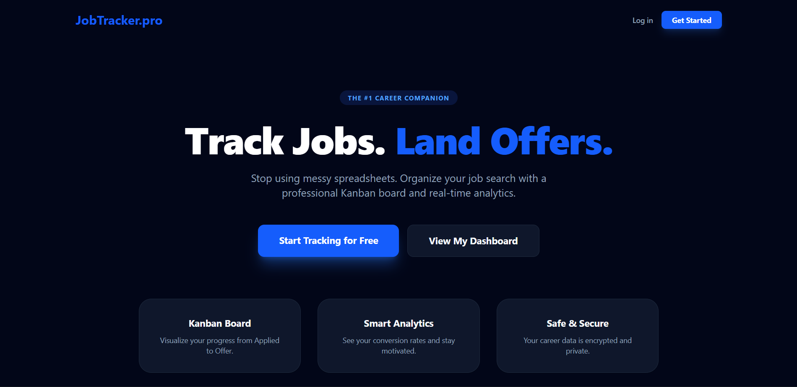
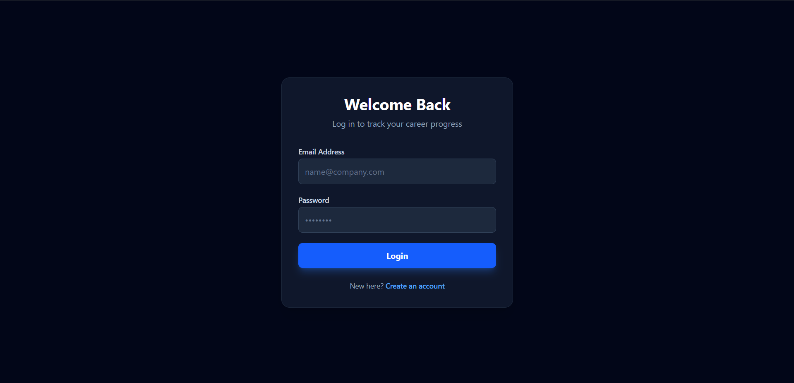
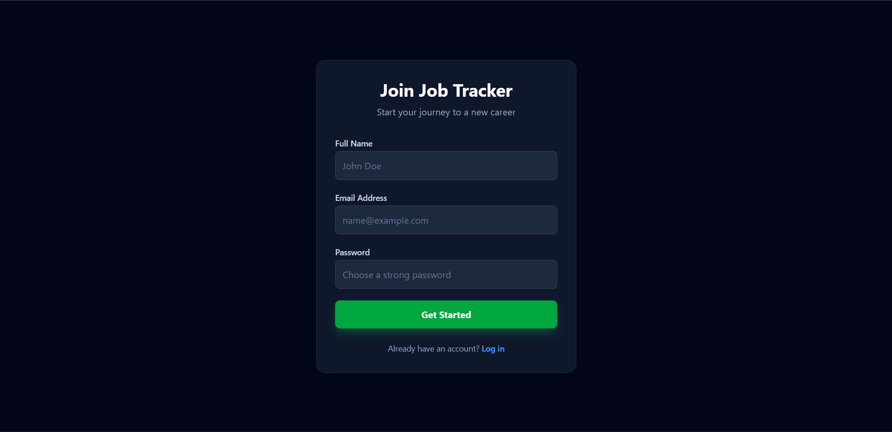
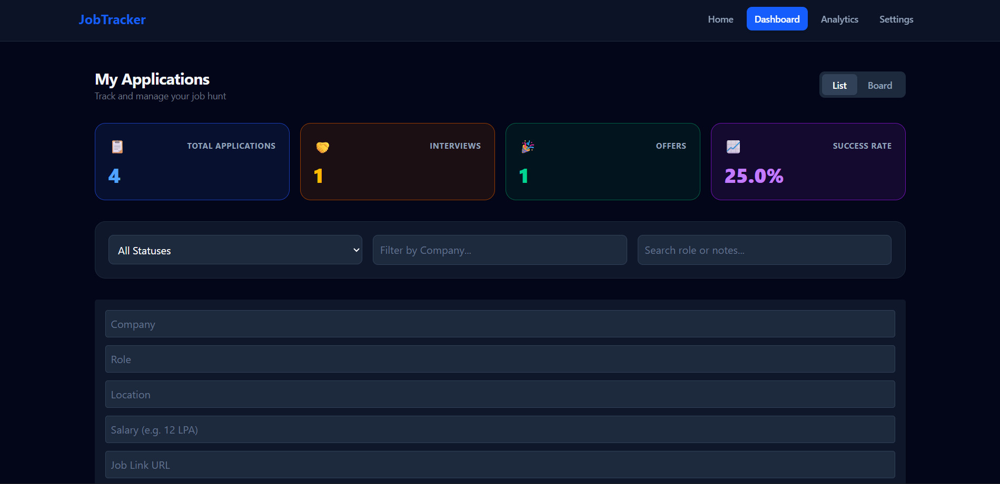
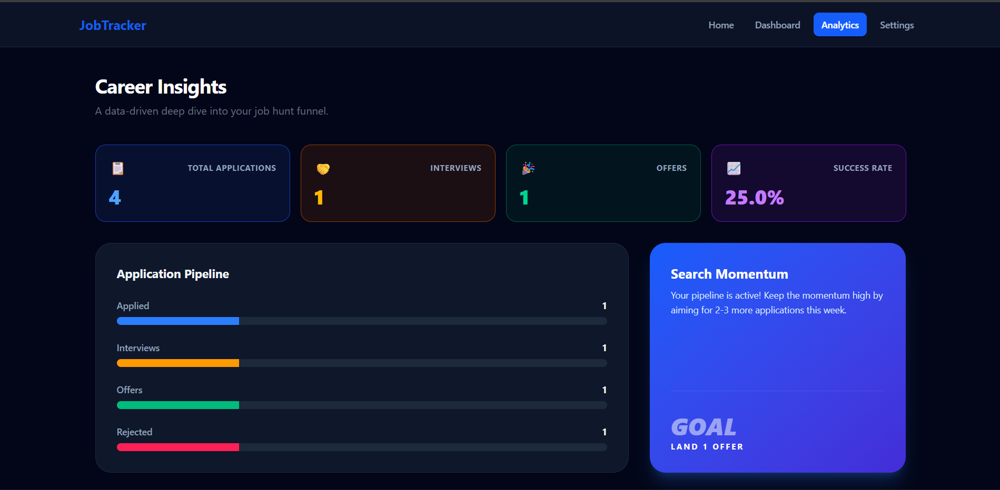
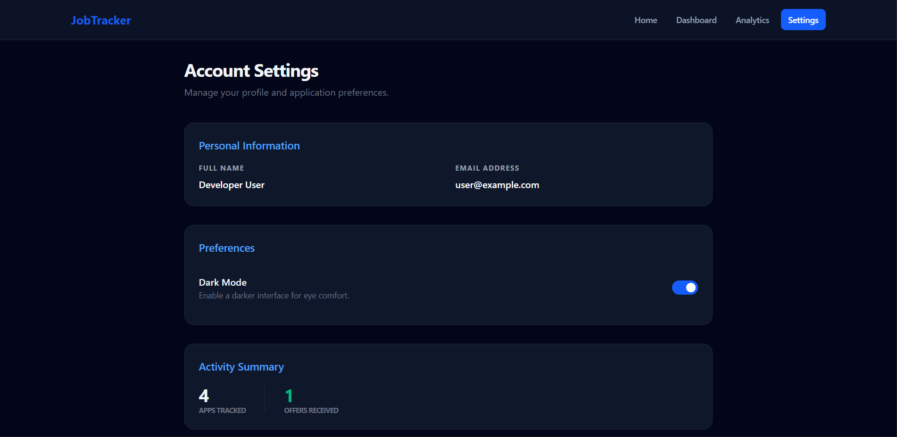

# JobTracker 🚀

**Track Jobs. Land Offers.**

JobTracker is a full-stack job application tracking platform that helps developers organize and manage their job search efficiently. Instead of messy spreadsheets, JobTracker provides a clean dashboard, analytics insights, and a structured pipeline to track every application from **Applied → Interview → Offer**.

---

# 🌐 Live Demo

- Frontend: https://job-application-tracker-frontend-t609.onrender.com/
- Backend API: https://job-application-tracker-backend-c62w.onrender.com

Demo Account 

- Email: [demo@jobtracker.com](mailto:demo@jobtracker.com)
- Password: demo123

---

# 💡 Problem It Solves

Most job seekers track applications using spreadsheets or notes, which quickly becomes difficult to manage.

JobTracker solves this by providing:

- A centralized job tracking dashboard
- Real-time application insights
- A structured pipeline for every application
- Analytics to measure job search success

---

# ✨ Features

### Authentication

- Secure user authentication
- Cookie / JWT based session management
- Protected dashboard routes

### Application Management

- Add job applications
- Edit application details
- Delete applications
- Track job stages (Applied, Interview, Offer, Rejected)

### Dashboard

- Overview of job search progress
- Total applications tracker
- Interview and offer tracking
- Success rate calculation

### Analytics

- Application funnel visualization
- Job search momentum insights
- Conversion rate tracking

### UI/UX

- Modern dark mode interface
- Responsive design
- Clean card-based dashboard layout

---

# 📸 Screenshots

### Landing Page



### Login Page



### Signup Page



### Dashboard



### Analytics Page



### Settings Page



---

# 🛠 Tech Stack

## Frontend

- React
- Vite
- TailwindCSS
- React Router
- Axios

## Backend

- Node.js
- Express.js
- MongoDB
- Mongoose
- JWT Authentication
- Cookie based authentication

## Deployment

- Render 

---

# 🏗 Architecture

Client (React + Vite)
↓
Axios API Layer
↓
Express REST API
↓
MongoDB Database

---

# 📂 Project Structure

```
jobtracker
│
├── frontend
│   ├── components
│   ├── pages
│   ├── hooks
│   ├── services
│   └── layouts
│   └── pages
│   └── utils
│
├── backend
│   ├── controllers
│   ├── repository
│   ├── services
│   ├── utils
│   ├── routes
│   ├── models
│   ├── middleware
│   └── config
```

---

# ⚙️ Installation

Clone the repository

```
git clone https://github.com/Good-Slime/Job-Tracker
```

## Backend Setup

```
cd Job-Tracker-Backend
npm install
npm start
```

## Frontend Setup

```
cd Job-Tracker-Frontend
npm install
npm run dev
```

Frontend runs on:

```
http://localhost:5173
```

Backend runs on:

```
http://localhost:5000
```

---

# 🔐 Environment Variables

Create a `.env` file inside the backend folder.

```
PORT=5000
MONGO_URI=your_mongodb_connection
JWT_SECRET=your_secret_key
CLIENT_URL=http://localhost:5173
```

Create a `.env` file inside the frontend folder.

```
VITE_API_URL=http://localhost:5000
```

---

# 📡 API Endpoints

## Authentication

POST /v1/signup
POST /v1/login
POST /v1/logout

## Applications

GET /v2/applications
POST /v2/applications
PUT /v2/applications/:id
DELETE /v2/applications/:id

---

# 🚀 Future Improvements

- Drag & drop Kanban board
- Resume upload support
- Interview reminder notifications
- Job scraping integration (LinkedIn / Indeed)
- AI based job match suggestions
- Multi-device synchronization

---

# 👨‍💻 Author

Karthik Reddy

GitHub
https://github.com/yourusername

LinkedIn
https://www.linkedin.com/in/n-karthik-reddy-a4bb93324/

---

# ⭐ Contributing

Pull requests are welcome.
For major changes, please open an issue first to discuss what you would like to change.

---

# 📄 License

This project is licensed under the MIT License.
